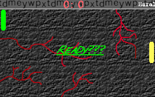
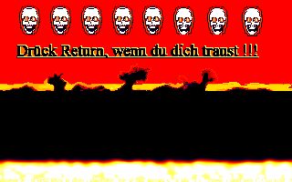

# "Nostrum Paddle Wars"

## An old Turbo Pascal 6.0 DOS-Game of mine

Back in the mid to late '90s I started a PONG-Clone and called it "Paddle Wars".  
"Finished" by 1997 (switching to Windows Programming and later Web-Development  
was just more fun, at that time ; ) I have no clue anymore, why I dedicated this game to  
my father, but here it is, as I've found it in some old Backup rescued  
from a 3.5" 1.44MB floppy-disk - as far as I remember.  
(Btw.: "Nostrum" was an imaginary business title, I gave me ; )



## Getting it to run

First clone or download this Repo, of course, to a place of your convenience.  
But don't forget, you have to mount that folder as drive C in DosBox later on!

Using [DosBox](https://www.dosbox.com/) it wasn't hard getting it up and running  
on my Linux Mint 18.3 machine nearly out of the "box".

I only had to tweak the Soundblaster variables a little in the  
dosbox.conf (more on their website in the Link above) and for  
my convenience auto mounted the Directory above the one I put it in.  
The original Folder was called "NPADWAR", but you should get it to run  
straight out of the Repo's-Folder.

When mounted, the file to run is ```NPADWAR.EXE```.  
The "Intro-Videos" (old Autodesk Animator Files) should nearly play at once.  
Please be a little patient while the game loads to the menu screen,  
although you should hear the Music (ScreamTracker MOD-File) playing
soon after the Videos.  
(it has to switch between Mode 13h for the Videos and ModeX for the Game.)

As the Game is completely in German, here's a little "translation helper":  

#### Menu Screen
* "Neues Spiel" stands for "New Game"
* "Optionen" means "Configuration" or "Options" and you get to a Config-screen
* "Quit" stands for "Quit" or "Exit" (oh who would have guessed)

#### Config Screen
* "Geschwindigkeit" means "Velocity" - the ball's, that is, as one can directly   
  observe, when one clicks the > (faster) or < (slower) arrows.
* "Methode" means "Method" and clicking one of the three icons next to it stands for:  
  1. On shooting a "goal", the one shooting it get's the ball  
  2. On shooting a "goal", the ball get's thrown in from above at a random position    
     between the players  
  3. The computer chooses randomly between the other two options after each goal  
* clicking "CPU" means a "highly developed AI" plays against you (right paddle)
* clicking "Mensch" (as in "Human") chooses such a oponent, whereby the First Player  
  with the left paddle plays by using the UP and DOWN Arrow-Keys
* Pressing the Up or Down buttons increases or decreases the "Matchball" accordingly
* "Zurück" means "Back", whereby the Options chosen get saved automatically

#### Pressing "Neues Spiel" / "New Game"

After a little loading break, you get to a "Preparation Screen" were
"Drück Return, wenn Du Dich traust !!!"  
shall warn you of the very danger you're getting in ("Press Return/Enter, if you dare" ; ).  
Don't know why the flame-animation at the bottom is running so slowly, one might  
have to tweak DosBox...  



After Pressing Return / Enter it might seem like the game is stuck on a black screen  
but when you give it a little time while it loads the huge amount of sprites,  
(while the In-Game-Music should play nearly at once), the Game Screen is presented
to you.  
The Game asks "Ready???" (I won't have to translate this, do I?) and starts after  
one of the players (if both are human) press either the left mouse button  
or the Space-bar.  

__Now it's time for a classic game of Paddle Wars, uhm, PONG!__   
Being in possession of the Ball, the left (human) player has to press Space
to kick it off again,  
the right player has to press the left mouse button.

The game goes on until either one of the players reaches the aforementioned Matchball,  
or one presses ESC or the right mouse button.  
Reaching the Matchball starts a message scrolling down with "Spieler 1/2 hat gewonnen"  
meaning "Player 1/2 has won" - but both winning or canceling the game will bring you  
back to the Menu Screen.

Have Phun : )!

### Technical

Sadly - at the moment, at least - I don't have all of the sources  
or .TPUs, anymore. Although I found a copy of the English Version  
of the Book "PC Underground" and it's attached CD-ROM online,  
the sources of the German one I built this with / bases it on seem  
to be advanced and / or differ with greater margin.

I was astounded, how much of it's inline TASM and Pascal-Sourcecode I'm still  
able to understand after all this time - but after some tinkering I stopped  
for the moment (until I get a bound copy of the German book ; ).  

For those of you curious how bad my code was those days, take a look at  
[NPAD2.PAS](src/NPAD2.PAS) - but as that file is in classic DOS (CP-437) encoding,  
I added [NPAD2_UTF8.PAS](src/NPAD2_UTF8.PAS) reencoded to UTF-8 as well.

In the file [Npadwar.txt](Npadwar.txt) my teenage self wrote me an explanation  
of how to play the game (and how *not* to write a documentation % ) in German.  
But more on the how-tos above.

### GitHub Archive Program

Let's hope that with this commit, "Nostrum Paddle Wars" is now gonna be _immortalized_ ^^.
Greetings to the future : )!
